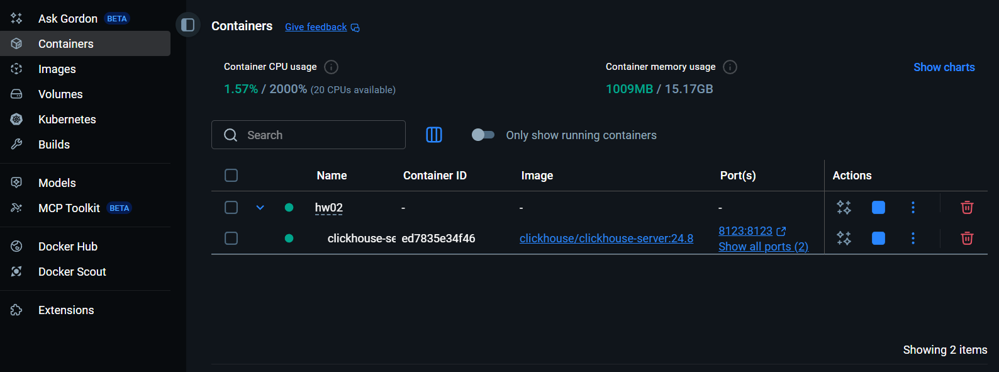
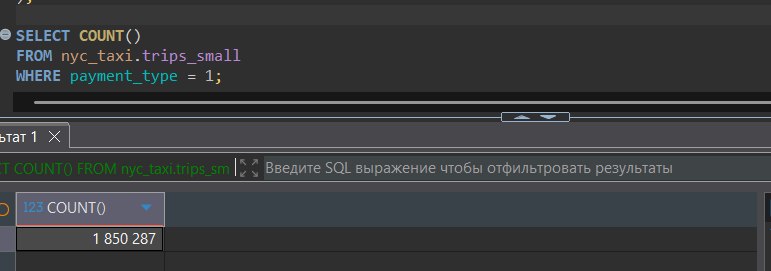
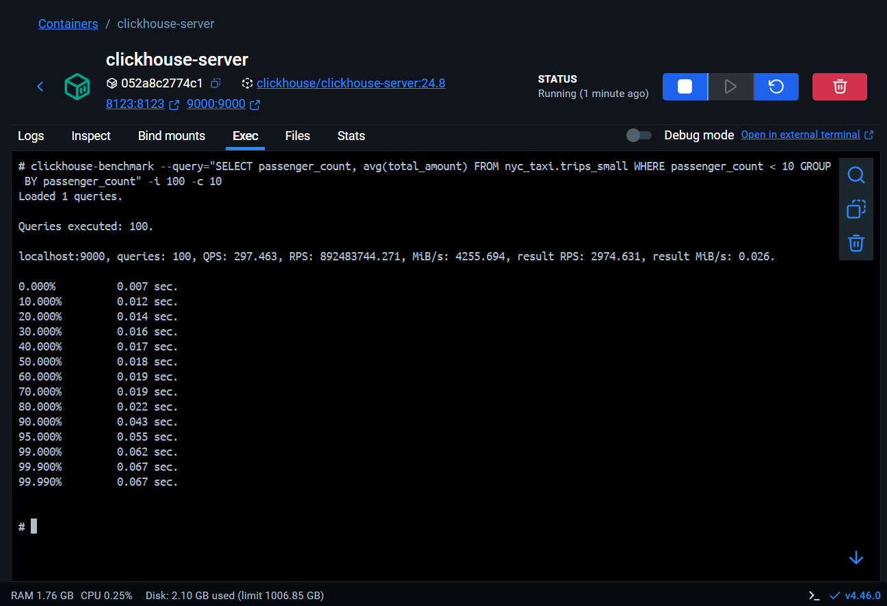
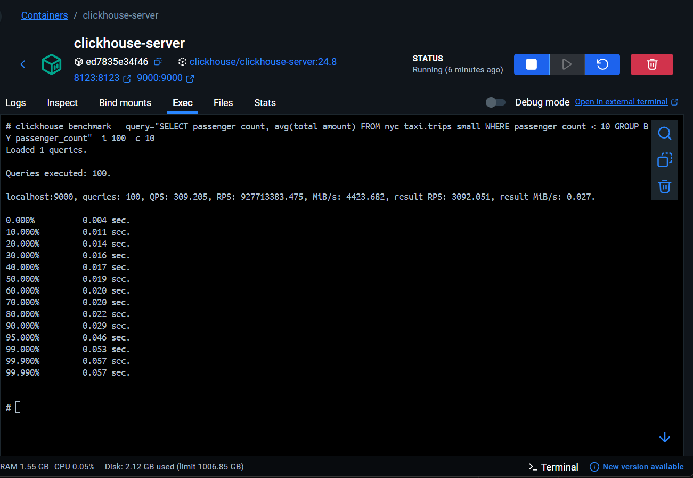

- Установлен ClickHouse. Запущен в docker контейнере с помощью docker-compose.yml.
 
- Скриншот контейнера с ClickHouse

- Загружен тестовый датасет
``` sql
CREATE DATABASE nyc_taxi;

CREATE TABLE nyc_taxi.trips_small (
    trip_id             UInt32,
    pickup_datetime     DateTime,
    dropoff_datetime    DateTime,
    pickup_longitude    Nullable(Float64),
    pickup_latitude     Nullable(Float64),
    dropoff_longitude   Nullable(Float64),
    dropoff_latitude    Nullable(Float64),
    passenger_count     UInt8,
    trip_distance       Float32,
    fare_amount         Float32,
    extra               Float32,
    tip_amount          Float32,
    tolls_amount        Float32,
    total_amount        Float32,
    payment_type        Enum('CSH' = 1, 'CRE' = 2, 'NOC' = 3, 'DIS' = 4, 'UNK' = 5),
    pickup_ntaname      LowCardinality(String),
    dropoff_ntaname     LowCardinality(String)
)
ENGINE = MergeTree
PRIMARY KEY (pickup_datetime, dropoff_datetime);


INSERT INTO nyc_taxi.trips_small
SELECT
    trip_id,
    pickup_datetime,
    dropoff_datetime,
    pickup_longitude,
    pickup_latitude,
    dropoff_longitude,
    dropoff_latitude,
    passenger_count,
    trip_distance,
    fare_amount,
    extra,
    tip_amount,
    tolls_amount,
    total_amount,
    payment_type,
    pickup_ntaname,
    dropoff_ntaname
FROM s3(
    'https://datasets-documentation.s3.eu-west-3.amazonaws.com/nyc-taxi/trips_{0..2}.gz',
    'TabSeparatedWithNames'
);
```
- Результат запроса SELECT COUNT() FROM nyc_taxi.trips_small WHERE payment_type = 1


- Проведено тестирование производительности


- Изучены конфигурационные файлы базы данных, сделаны настройки с учётом характеристик текущей ОС (количества ядер процессора и оперативной памяти), оптимизированы параметры.

``` xml
    <clickhouse>
        <remote_servers>
            <default>
                <shard>
                    <replica>
                        <host>localhost</host>
                        <port>9000</port>
                    </replica>
                </shard>
            </default>
        </remote_servers>

        <profiles>
            <default>
                <max_memory_usage>6000000000</max_memory_usage>
                <max_memory_usage_for_user>6600000000</max_memory_usage_for_user>
                <max_threads>4</max_threads>
                <use_uncompressed_cache>1</use_uncompressed_cache>
                <max_bytes_before_external_group_by>2000000000</max_bytes_before_external_group_by>
                <max_bytes_before_external_sort>2000000000</max_bytes_before_external_sort>
            </default>
        </profiles>
    </clickhouse>
```

- Проведено повторное тестирование производительности


- Основные метрики производительности

| Метрика | До настройки | После настройки | Изменение |
|---------|-------------|----------------|-----------|
| **QPS** (запросов в секунду) | 297.463 | 309.205 | **+3.9%** |
| **RPS** (строк в секунду) | 892.48M | 927.71M | **+3.9%** |
| **MB/s** (Пропускная способность) | 4255.694 | 4423.682 | **+3.9%** |

- Улучшения после настройки:
1. **Небольшое увеличение производительности** (~4%) по всем основным метрикам
2. **Улучшение времени отклика** на высоких перцентилях:
   - 99-й перцентиль: 0.062с → 0.053с (**-14.5%**)
   - 95-й перцентиль: 0.055с → 0.046с (**-16.4%**)
   - 90-й перцентиль: 0.043с → 0.029с (**-32.6%**)

- Настройки, которые дали наибольший эффект:
    - Использование кэша несжатых данных (`use_uncompressed_cache=1` )
    - Настроенные лимиты памяти для агрегации и сортировки
    - Настроенный параллелизм (`max_threads=4`)
