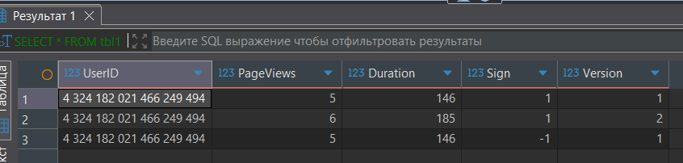
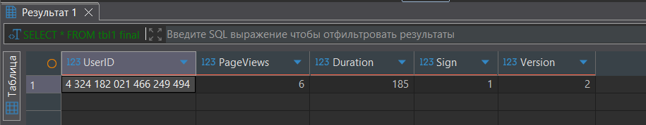
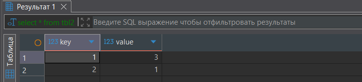
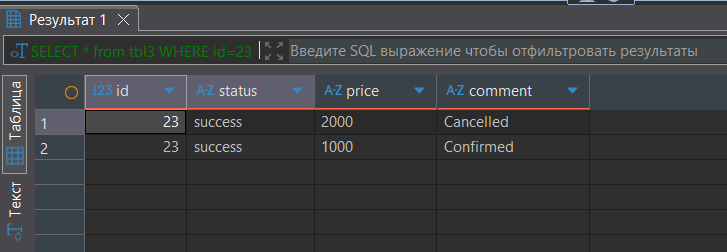
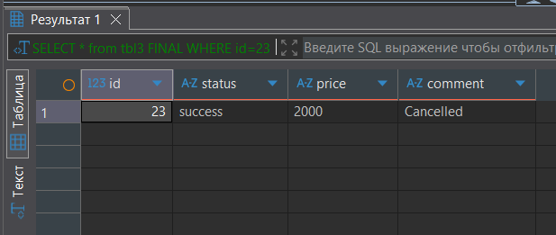
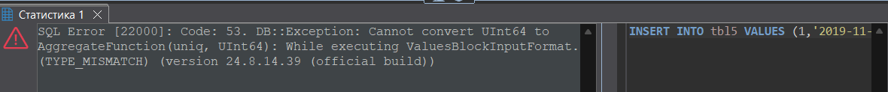
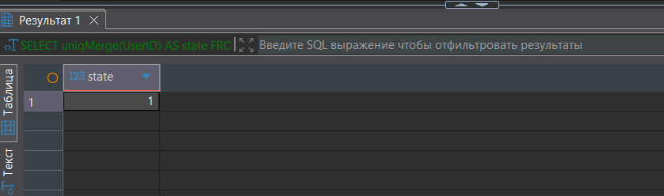
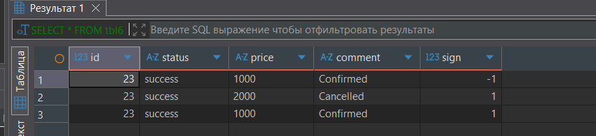
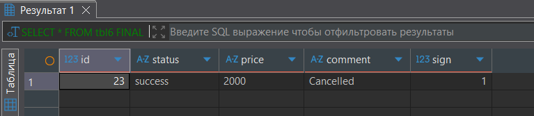

## Задание 1
``` sql
CREATE TABLE tbl1
(
    UserID UInt64,
    PageViews UInt8,
    Duration UInt8,
    Sign Int8,
    Version UInt8
)
ENGINE = VersionedCollapsingMergeTree(Sign, Version)
ORDER BY UserID;


INSERT INTO tbl1 VALUES (4324182021466249494, 5, 146, -1, 1);
INSERT INTO tbl1 VALUES (4324182021466249494, 5, 146, 1, 1),(4324182021466249494, 6, 185, 1, 2);

SELECT * FROM tbl1;
```


``` sql
SELECT * FROM tbl1 final;
```


## Задание 2
``` sql
CREATE TABLE tbl2
(
    key UInt32,
    value UInt32
)
ENGINE = SummingMergeTree()
ORDER BY key;


INSERT INTO tbl2 Values(1,1),(1,2),(2,1);

select * from tbl2;
```


## Задание 3
``` sql
CREATE TABLE tbl3
(
    `id` Int32,
    `status` String,
    `price` String,
    `comment` String
)
ENGINE = ReplacingMergeTree()
PRIMARY KEY (id)
ORDER BY (id, status);


INSERT INTO tbl3 VALUES (23, 'success', '1000', 'Confirmed');
INSERT INTO tbl3 VALUES (23, 'success', '2000', 'Cancelled');

SELECT * from tbl3 WHERE id=23;
```



``` sql
SELECT * from tbl3 FINAL WHERE id=23;
```


## Задание 4
``` sql
CREATE TABLE tbl4
(   CounterID UInt8,
    StartDate Date,
    UserID UInt64
) ENGINE = MergeTree()
PARTITION BY toYYYYMM(StartDate) 
ORDER BY (CounterID, StartDate);

INSERT INTO tbl4 VALUES(0, '2019-11-11', 1);
INSERT INTO tbl4 VALUES(1, '2019-11-12', 1);

CREATE TABLE tbl5
(   CounterID UInt8,
    StartDate Date,
    UserID AggregateFunction(uniq, UInt64)
) ENGINE = AggregatingMergeTree()
PARTITION BY toYYYYMM(StartDate) 
ORDER BY (CounterID, StartDate);

INSERT INTO tbl5
select CounterID, StartDate, uniqState(UserID)
from tbl4
group by CounterID, StartDate;


INSERT INTO tbl5 VALUES (1,'2019-11-12',1);
```


``` sql
SELECT uniqMerge(UserID) AS state 
FROM tbl5 
GROUP BY CounterID, StartDate;
```



## Задание 5
``` sql
CREATE TABLE tbl6
(
    `id` Int32,
    `status` String,
    `price` String,
    `comment` String,
    `sign` Int8
)
ENGINE = CollapsingMergeTree(sign)
PRIMARY KEY (id)
ORDER BY (id, status);

INSERT INTO tbl6 VALUES (23, 'success', '1000', 'Confirmed', 1);
INSERT INTO tbl6 VALUES (23, 'success', '1000', 'Confirmed', -1), (23, 'success', '2000', 'Cancelled', 1);

SELECT * FROM tbl6;
```


``` sql
SELECT * FROM tbl6 FINAL;
```
