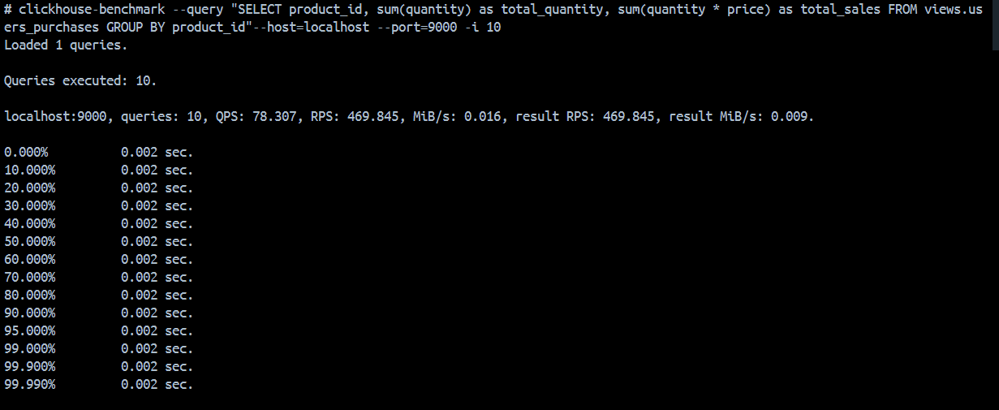
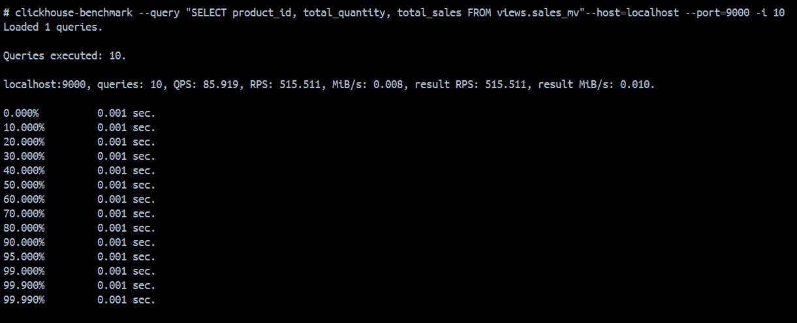

1. Создание таблицы

``` sql
CREATE DATABASE views;

CREATE TABLE views.users_purchases
(
    id UInt32,
	product_id UInt32,
	quantity UInt32,
	price Float32,
	sale_date DateTime
) ENGINE = MergeTree ORDER BY (product_id, sale_date);

INSERT INTO views.users_purchases (id, product_id, quantity, price, sale_date) VALUES
(1, 101, 2, 1499.99, '2024-01-15 10:30:00'),
(2, 205, 1, 899.50, '2024-01-16 14:20:00'),
(3, 101, 3, 1499.99, '2024-01-17 09:15:00'),
(4, 302, 5, 249.99, '2024-01-18 16:45:00'),
(5, 205, 2, 899.50, '2024-01-19 11:10:00'),
(6, 418, 1, 3299.00, '2024-01-20 13:25:00'),
(7, 302, 1, 249.99, '2024-01-21 15:40:00'),
(8, 101, 1, 1499.99, '2024-01-22 12:00:00'),
(9, 567, 10, 99.99, '2024-01-23 17:30:00'),
(10, 418, 2, 3299.00, '2024-01-24 10:45:00'),
(11, 643, 3, 499.50, '2024-01-25 14:55:00'),
(12, 567, 5, 99.99, '2024-01-26 09:20:00'),
(13, 205, 1, 899.50, '2024-01-27 16:10:00'),
(14, 302, 2, 249.99, '2024-01-28 11:35:00'),
(15, 643, 1, 499.50, '2024-01-29 13:50:00');
```

2. Создание проекции
``` sql
ALTER TABLE views.users_purchases
ADD PROJECTION sales_projection
(
    SELECT
        product_id,
        sum(quantity) as total_quantity,
        sum(quantity * price) as total_sales
    GROUP BY product_id
);

ALTER TABLE views.users_purchases MATERIALIZE PROJECTION sales_projection;
```

3. Создание материализованного представления
``` sql
CREATE TABLE views.sales_summary
(
    product_id UInt32,
    total_quantity UInt32,
    total_sales Float64
) ENGINE = SummingMergeTree()
ORDER BY product_id;

CREATE MATERIALIZED VIEW views.sales_mv TO views.sales_summary AS
SELECT
    product_id,
    sum(quantity) AS total_quantity,
    sum(quantity * price) AS total_sales
FROM views.users_purchases
GROUP BY product_id;
```

4. Сравнение производительности запросов
``` sql
SELECT * FROM views.users_purchases;
```

``` sql
SELECT
    product_id,
    sum(quantity) as total_quantity,
    sum(quantity * price) as total_sales
FROM views.users_purchases
GROUP BY product_id;
```
``` 
clickhouse-benchmark --query "SELECT product_id, sum(quantity) as total_quantity, sum(quantity * price) as total_sales FROM views.users_purchases GROUP BY product_id"--host=localhost --port=9000 -i 10
```



``` sql
SELECT 
	product_id,
	total_quantity,
	total_sales
FROM views.sales_mv;
```
```
clickhouse-benchmark --query "SELECT product_id, total_quantity, total_sales FROM views.sales_mv"--host=localhost --port=9000 -i 10
```


| Метрика | Обычная проекция (View) | Материализованное представление (MV) | Разница |
|---------|------------------------|-----------------------------------|---------|
| **QPS** (запросов/сек) | 78.307 | 85.919 | **+9.7%** |
| **RPS** (строк/сек) | 469.845 | 515.511 | **+9.7%** |


**Материализованное представление демонстрирует преимущество** в производительности благодаря предварительным вычислениям и хранению рассчитанных агрегатов.