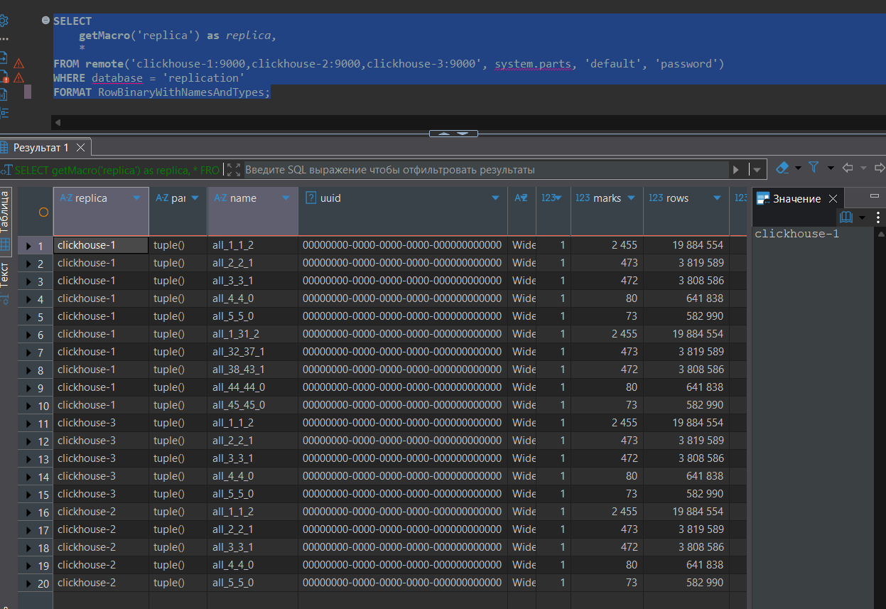
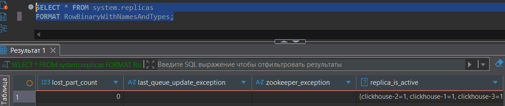
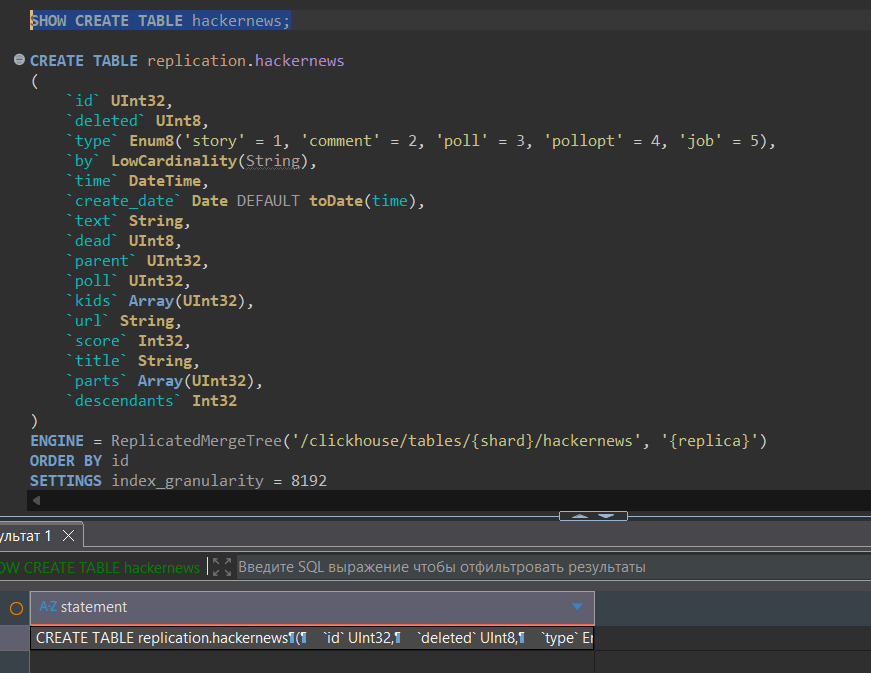

1.  DDL исходной таблицы
``` sql
CREATE DATABASE replication;

USE replication;

DROP TABLE IF EXISTS hackernews;

CREATE TABLE hackernews
(
    `id` UInt32,
    `deleted` UInt8,
    `type` Enum('story' = 1, 'comment' = 2, 'poll' = 3, 'pollopt' = 4, 'job' = 5),
    `by` LowCardinality(String),
    `time` DateTime,
    `text` String,
    `dead` UInt8,
    `parent` UInt32,
    `poll` UInt32,
    `kids` Array(UInt32),
    `url` String,
    `score` Int32,
    `title` String,
    `parts` Array(UInt32),
    `descendants` Int32
) ENGINE = MergeTree
ORDER BY (id);

INSERT INTO hackernews
SELECT *
FROM url('https://datasets-documentation.s3.eu-west-3.amazonaws.com/hackernews/hacknernews.csv.gz', CSVWithNames);
```

2. Конвертируем таблицу в реплицируемую, используя макрос replica.
```
docker exec -it clickhouse-server-1 clickhouse-client --password password
```

``` sql
USE replication;

CREATE TABLE hackernews
(
    `id` UInt32,
    `deleted` UInt8,
    `type` Enum('story' = 1, 'comment' = 2, 'poll' = 3, 'pollopt' = 4, 'job' = 5),
    `by` LowCardinality(String),
    `time` DateTime,
    `text` String,
    `dead` UInt8,
    `parent` UInt32,
    `poll` UInt32,
    `kids` Array(UInt32),
    `url` String,
    `score` Int32,
    `title` String,
    `parts` Array(UInt32),
    `descendants` Int32
) ENGINE = ReplicatedMergeTree('/clickhouse/tables/{shard}/hackernews', '{replica}')
ORDER BY (id);

SYSTEM STOP MERGES hackernews_replicated;

ALTER TABLE hackernews_replicated ATTACH PARTITION ID 'all' FROM hackernews; 

SYSTEM START MERGES hackernews_replicated;

RENAME TABLE hackernews TO hackernews_old, hackernews_replicated TO hackernews;
```

3. Добавляем две реплики
```
docker exec -it clickhouse-server-2 clickhouse-client --password password
```

``` sql
CREATE DATABASE replication;

USE replication;

CREATE TABLE hackernews
(
    `id` UInt32,
    `deleted` UInt8,
    `type` Enum('story' = 1, 'comment' = 2, 'poll' = 3, 'pollopt' = 4, 'job' = 5),
    `by` LowCardinality(String),
    `time` DateTime,
    `text` String,
    `dead` UInt8,
    `parent` UInt32,
    `poll` UInt32,
    `kids` Array(UInt32),
    `url` String,
    `score` Int32,
    `title` String,
    `parts` Array(UInt32),
    `descendants` Int32
) ENGINE = ReplicatedMergeTree('/clickhouse/tables/{shard}/hackernews', '{replica}')
ORDER BY (id);
```

```
docker exec -it clickhouse-server-3 clickhouse-client --password password
```

``` sql
CREATE DATABASE replication;

USE replication;

CREATE TABLE hackernews
(
    `id` UInt32,
    `deleted` UInt8,
    `type` Enum('story' = 1, 'comment' = 2, 'poll' = 3, 'pollopt' = 4, 'job' = 5),
    `by` LowCardinality(String),
    `time` DateTime,
    `text` String,
    `dead` UInt8,
    `parent` UInt32,
    `poll` UInt32,
    `kids` Array(UInt32),
    `url` String,
    `score` Int32,
    `title` String,
    `parts` Array(UInt32),
    `descendants` Int32
) ENGINE = ReplicatedMergeTree('/clickhouse/tables/{shard}/hackernews', '{replica}')
ORDER BY (id);
```

3. Выполняем запросы*
- Использование FORMAT JSONEachRow, поэтому изменено на другой  формат вывода
```sql
SELECT 
    getMacro('replica') as replica,
    * 
FROM remote('clickhouse-1:9000,clickhouse-2:9000,clickhouse-3:9000', system.parts, 'default', 'password')
WHERE database = 'replication'
FORMAT RowBinaryWithNamesAndTypes;
```


```sql
SELECT * FROM system.replicas 
FORMAT RowBinaryWithNamesAndTypes;
```


4. Добавлена колонка с типом Date в таблице, добавлен TTL на таблицу «хранить последние 7 дней».
```sql
ALTER TABLE hackernews
ADD COLUMN create_date Date DEFAULT toDate(time) 
AFTER time;

ALTER TABLE hackernews
MODIFY TTL date_column + INTERVAL 7 DAY DELETE;
```

```sql
SHOW CREATE TABLE hackernews;
```


Скопированный результат выводы:
```sql
CREATE TABLE replication.hackernews
(
    `id` UInt32,
    `deleted` UInt8,
    `type` Enum8('story' = 1, 'comment' = 2, 'poll' = 3, 'pollopt' = 4, 'job' = 5),
    `by` LowCardinality(String),
    `time` DateTime,
    `create_date` Date DEFAULT toDate(time),
    `text` String,
    `dead` UInt8,
    `parent` UInt32,
    `poll` UInt32,
    `kids` Array(UInt32),
    `url` String,
    `score` Int32,
    `title` String,
    `parts` Array(UInt32),
    `descendants` Int32
)
ENGINE = ReplicatedMergeTree('/clickhouse/tables/{shard}/hackernews', '{replica}')
ORDER BY id
SETTINGS index_granularity = 8192
```