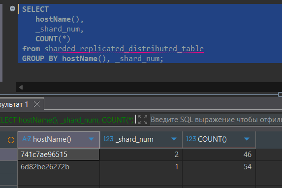
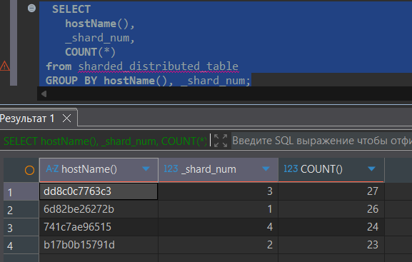
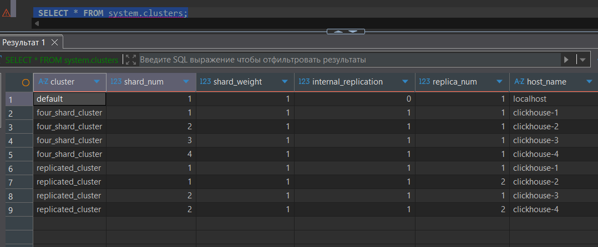

1. DDL
```
docker exec -it clickhouse-server-1 clickhouse-client --password password
docker exec -it clickhouse-server-2 clickhouse-client --password password
docker exec -it clickhouse-server-3 clickhouse-client --password password
docker exec -it clickhouse-server-4 clickhouse-client --password password
```

``` sql
CREATE DATABASE shards;

CREATE TABLE sharded_replicated_table
(
    ID UInt32,
    Name String
) ENGINE = ReplicatedMergeTree('/clickhouse/tables/replicated_cluster/{shard}/{database}_{table}', '{replica}')
ORDER BY (ID);

CREATE TABLE sharded_replicated_distributed_table
(
    ID UInt32,
    Name String
) 
ENGINE = Distributed('replicated_cluster', 'default', sharded_replicated_table, rand());

INSERT INTO sharded_replicated_distributed_table (ID, Name) VALUES
(1, 'User_1'), (2, 'User_2'), (3, 'User_3'), (4, 'User_4'), (5, 'User_5'),
(6, 'User_6'), (7, 'User_7'), (8, 'User_8'), (9, 'User_9'), (10, 'User_10'),
(11, 'User_11'), (12, 'User_12'), (13, 'User_13'), (14, 'User_14'), (15, 'User_15'),
(16, 'User_16'), (17, 'User_17'), (18, 'User_18'), (19, 'User_19'), (20, 'User_20'),
(21, 'User_21'), (22, 'User_22'), (23, 'User_23'), (24, 'User_24'), (25, 'User_25'),
(26, 'User_26'), (27, 'User_27'), (28, 'User_28'), (29, 'User_29'), (30, 'User_30'),
(31, 'User_31'), (32, 'User_32'), (33, 'User_33'), (34, 'User_34'), (35, 'User_35'),
(36, 'User_36'), (37, 'User_37'), (38, 'User_38'), (39, 'User_39'), (40, 'User_40'),
(41, 'User_41'), (42, 'User_42'), (43, 'User_43'), (44, 'User_44'), (45, 'User_45'),
(46, 'User_46'), (47, 'User_47'), (48, 'User_48'), (49, 'User_49'), (50, 'User_50'),
(51, 'User_51'), (52, 'User_52'), (53, 'User_53'), (54, 'User_54'), (55, 'User_55'),
(56, 'User_56'), (57, 'User_57'), (58, 'User_58'), (59, 'User_59'), (60, 'User_60'),
(61, 'User_61'), (62, 'User_62'), (63, 'User_63'), (64, 'User_64'), (65, 'User_65'),
(66, 'User_66'), (67, 'User_67'), (68, 'User_68'), (69, 'User_69'), (70, 'User_70'),
(71, 'User_71'), (72, 'User_72'), (73, 'User_73'), (74, 'User_74'), (75, 'User_75'),
(76, 'User_76'), (77, 'User_77'), (78, 'User_78'), (79, 'User_79'), (80, 'User_80'),
(81, 'User_81'), (82, 'User_82'), (83, 'User_83'), (84, 'User_84'), (85, 'User_85'),
(86, 'User_86'), (87, 'User_87'), (88, 'User_88'), (89, 'User_89'), (90, 'User_90'),
(91, 'User_91'), (92, 'User_92'), (93, 'User_93'), (94, 'User_94'), (95, 'User_95'),
(96, 'User_96'), (97, 'User_97'), (98, 'User_98'), (99, 'User_99'), (100, 'User_100');

SELECT * FROM sharded_replicated_distributed_table ORDER BY ID;
```

``` sql
CREATE TABLE sharded_table
(
    ID UInt32,
    Name String
) ENGINE = ReplicatedMergeTree('/clickhouse/tables/four_shard_cluster/{shard}/{database}_{table}', '{replica}')
ORDER BY (ID);

CREATE TABLE sharded_distributed_table
(
    ID UInt32,
    Name String
) 
ENGINE = Distributed('four_shard_cluster', 'default', sharded_table, rand());


INSERT INTO sharded_distributed_table (ID, Name) VALUES
(1, 'Text_1'), (2, 'Text_2'), (3, 'Text_3'), (4, 'Text_4'), (5, 'Text_5'),
(6, 'Text_6'), (7, 'Text_7'), (8, 'Text_8'), (9, 'Text_9'), (10, 'Text_10'),
(11, 'Text_11'), (12, 'Text_12'), (13, 'Text_13'), (14, 'Text_14'), (15, 'Text_15'),
(16, 'Text_16'), (17, 'Text_17'), (18, 'Text_18'), (19, 'Text_19'), (20, 'Text_20'),
(21, 'Text_21'), (22, 'Text_22'), (23, 'Text_23'), (24, 'Text_24'), (25, 'Text_25'),
(26, 'Text_26'), (27, 'Text_27'), (28, 'Text_28'), (29, 'Text_29'), (30, 'Text_30'),
(31, 'Text_31'), (32, 'Text_32'), (33, 'Text_33'), (34, 'Text_34'), (35, 'Text_35'),
(36, 'Text_36'), (37, 'Text_37'), (38, 'Text_38'), (39, 'Text_39'), (40, 'Text_40'),
(41, 'Text_41'), (42, 'Text_42'), (43, 'Text_43'), (44, 'Text_44'), (45, 'Text_45'),
(46, 'Text_46'), (47, 'Text_47'), (48, 'Text_48'), (49, 'Text_49'), (50, 'Text_50'),
(51, 'Text_51'), (52, 'Text_52'), (53, 'Text_53'), (54, 'Text_54'), (55, 'Text_55'),
(56, 'Text_56'), (57, 'Text_57'), (58, 'Text_58'), (59, 'Text_59'), (60, 'Text_60'),
(61, 'Text_61'), (62, 'Text_62'), (63, 'Text_63'), (64, 'Text_64'), (65, 'Text_65'),
(66, 'Text_66'), (67, 'Text_67'), (68, 'Text_68'), (69, 'Text_69'), (70, 'Text_70'),
(71, 'Text_71'), (72, 'Text_72'), (73, 'Text_73'), (74, 'Text_74'), (75, 'Text_75'),
(76, 'Text_76'), (77, 'Text_77'), (78, 'Text_78'), (79, 'Text_79'), (80, 'Text_80'),
(81, 'Text_81'), (82, 'Text_82'), (83, 'Text_83'), (84, 'Text_84'), (85, 'Text_85'),
(86, 'Text_86'), (87, 'Text_87'), (88, 'Text_88'), (89, 'Text_89'), (90, 'Text_90'),
(91, 'Text_91'), (92, 'Text_92'), (93, 'Text_93'), (94, 'Text_94'), (95, 'Text_95'),
(96, 'Text_96'), (97, 'Text_97'), (98, 'Text_98'), (99, 'Text_99'), (100, 'Text_100');

SELECT * FROM sharded_distributed_table ORDER BY ID;
```


2. Запросы
``` sql
SELECT 
    hostName(),
    _shard_num,
    COUNT(*)
from sharded_replicated_distributed_table
GROUP BY hostName(), _shard_num;
 ```
 

 ``` sql
SELECT 
    hostName(),
    _shard_num,
    COUNT(*)
from sharded_distributed_table
GROUP BY hostName(), _shard_num;
 ```


``` sql
SELECT * FROM system.clusters;
```



 ``` sql
SHOW CREATE TABLE sharded_replicated_distributed_table;

CREATE TABLE default.sharded_replicated_distributed_table
(
    `ID` UInt32,
    `Name` String
)
ENGINE = Distributed('replicated_cluster', 'default', 'sharded_replicated_table', rand());


SHOW CREATE TABLE sharded_distributed_table;

CREATE TABLE default.sharded_distributed_table
(
    `ID` UInt32,
    `Name` String
)
ENGINE = Distributed('four_shard_cluster', 'default', 'sharded_table', rand());
 ```