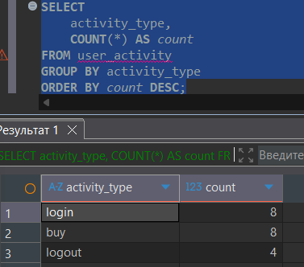
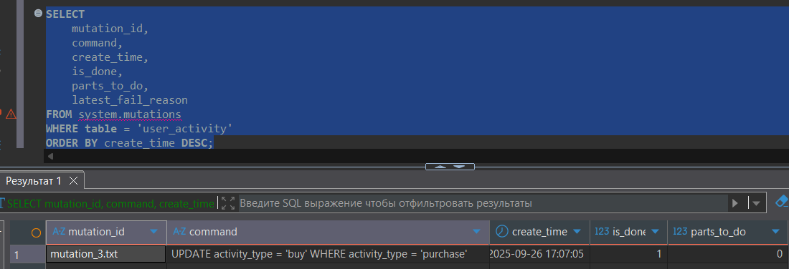
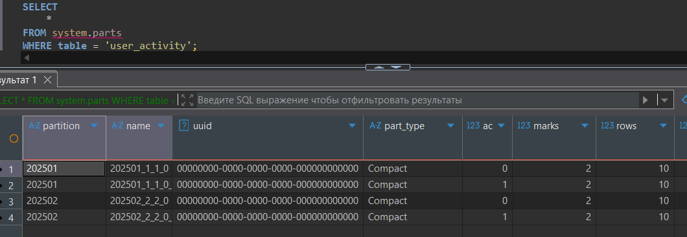
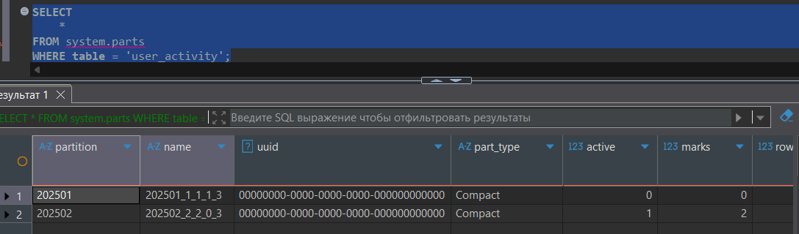
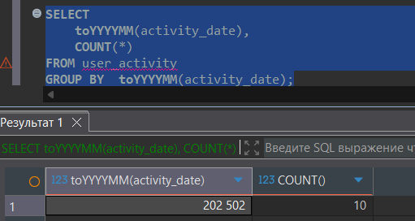

1. Создание таблицы

``` sql
CREATE DATABASE mutations;
USE mutations;

CREATE TABLE user_activity
(
    user_id       UInt32,
    activity_type String,
    activity_date DateTime
)
ENGINE = MergeTree()
PARTITION BY toYYYYMM(activity_date)
ORDER BY (user_id, activity_date);
```

2. Заполнение таблицы

``` sql
INSERT INTO user_activity VALUES
(1, 'login', '2025-01-05 08:30:15'),
(2, 'purchase', '2025-01-05 09:15:22'),
(3, 'login', '2025-01-07 10:45:33'),
(1, 'logout', '2025-01-07 12:20:18'),
(4, 'purchase', '2025-01-10 14:30:45'),
(5, 'login', '2025-01-12 16:55:10'),
(2, 'logout', '2025-01-15 11:10:25'),
(3, 'purchase', '2025-01-18 13:40:30'),
(4, 'login', '2025-01-22 09:25:15'),
(5, 'purchase', '2025-01-25 17:35:20'),

(1, 'login', '2025-02-02 08:15:10'),
(2, 'purchase', '2025-02-05 10:30:45'),
(6, 'login', '2025-02-07 11:20:30'),
(3, 'logout', '2025-02-08 14:45:15'),
(4, 'purchase', '2025-02-10 16:20:40'),
(7, 'login', '2025-02-12 09:35:25'),
(5, 'logout', '2025-02-15 12:50:10'),
(6, 'purchase', '2025-02-18 15:15:35'),
(7, 'login', '2025-02-20 10:40:20'),
(1, 'purchase', '2025-02-28 18:25:55');
```

3. Выполнение мутаций
``` sql
ALTER TABLE user_activity 
UPDATE activity_type = 'buy' 
WHERE activity_type = 'purchase';
```

4. Проверка результатов мутации
``` sql
SELECT
    activity_type,
    COUNT(*) AS count
FROM user_activity
GROUP BY activity_type
ORDER BY count DESC;
```



``` sql
SELECT
    mutation_id,
    command,
    create_time,
    is_done,
    parts_to_do,
    latest_fail_reason
FROM system.mutations
WHERE table = 'user_activity'
ORDER BY create_time DESC;
```


5. Манипуляции с партициями
``` sql
SELECT
	*
FROM system.parts 
WHERE table = 'user_activity';
```


``` sql
ALTER TABLE user_activity DROP PARTITION 202501;

SELECT
	*
FROM system.parts 
WHERE table = 'user_activity';
```


``` sql
SELECT 
	toYYYYMM(activity_date),
	COUNT(*) 
FROM user_activity 
GROUP BY  toYYYYMM(activity_date);
```
