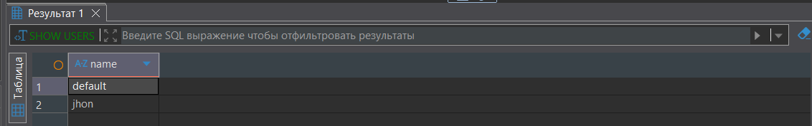
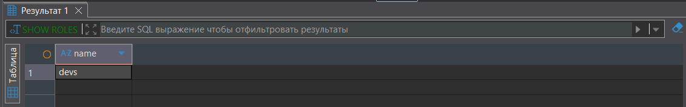
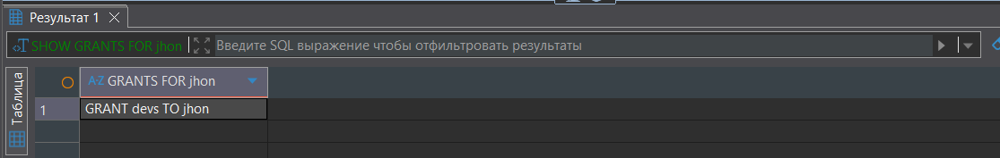
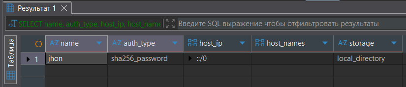
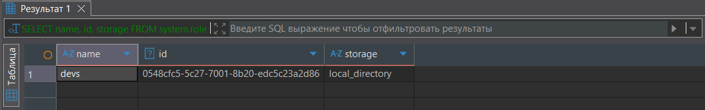
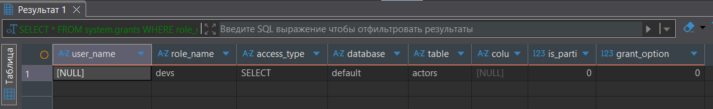
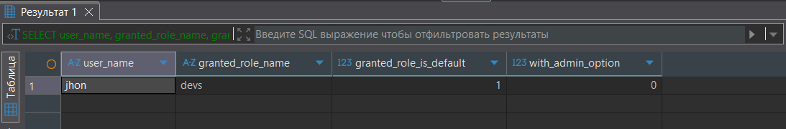

1. DDL
``` sql
CREATE TABLE actors
(
    id         UInt32,
    first_name String,
    last_name  String,
    gender     FixedString(1)
) ENGINE = MergeTree ORDER BY (id, first_name, last_name, gender);
```

2. Создание пользователя
``` sql
CREATE USER jhon IDENTIFIED WITH sha256_password BY 'qwerty';
SHOW USERS;
```


3. Создание роли
``` sql
CREATE ROLE devs;
SHOW ROLES;
```


4. Добавление роли devs прав на таблицу actors
``` sql
GRANT SELECT ON actors TO devs;
```

5. Добавление роли devs пользователю jhon
``` sql
GRANT devs TO jhon;
SHOW GRANTS FOR jhon;
```


6. Проверка созданных сущностей
``` sql
SELECT name, auth_type, host_ip, host_names, storage
FROM system.users 
WHERE name = 'jhon';
```


``` sql
SELECT name, id, storage
FROM system.roles 
WHERE name = 'devs';
```


``` sql
SELECT *
FROM system.grants
WHERE role_name = 'devs';
```


``` sql
SELECT user_name, granted_role_name, granted_role_is_default, with_admin_option
FROM system.role_grants 
WHERE user_name = 'jhon' AND granted_role_name = 'devs';
```
